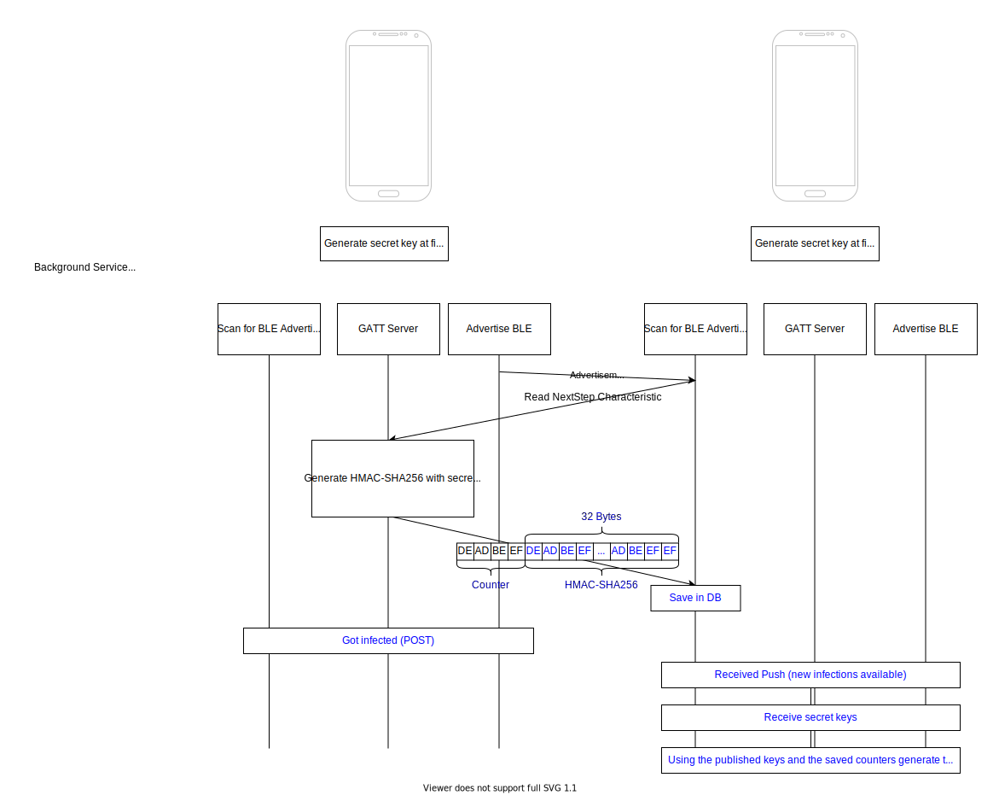

# STAR SDK Documentation

## Introduction

Here we try to provide a  complete overview and give some more technical details in the mechanisms used.

## Backend
The backend consists of two parts. The first part is a global server (for now hosted on github), which provides all the known app registrations. The API Documentation can be found [here (HTML)](backend-swagger/discovery.html) or [here (Swagger)](backend-swagger/discovery.yaml).

The SDK specific backend, which is also hosted by the app provider has its definition [here (HTML)](backend-swagger/sdk.html) or [here (Swagger)](backend-swagger/sdk.yaml).

## Architecture

The following picture shows the complete architecture. It tries to showcase how the SDK is integrated into a example App and how the servers should communicate

## TOTP Mechanism and Data Privacy

In order to guarantee privacy regulations and ensure anonymity a cryptographically secure mechanism is used. For every contact, a Timed One Time Password (TOTP) token is exchanged, generated with a secret key. As soon as a person is infected the app uploads the secret key and adds it to the infected list.

Every application, which integrates the SDK sees this key and can thanks to the key validate if one of the tokens matches.

Since those tokens change every defined time interval, it is not possible to track an ID of a specific device. 

The figure tries to show this process in a timeline based approach.

The TOTP tokens are generated using a HMAC-SHA256 algorithm provided by the platforms themselves (Android and iOS).

